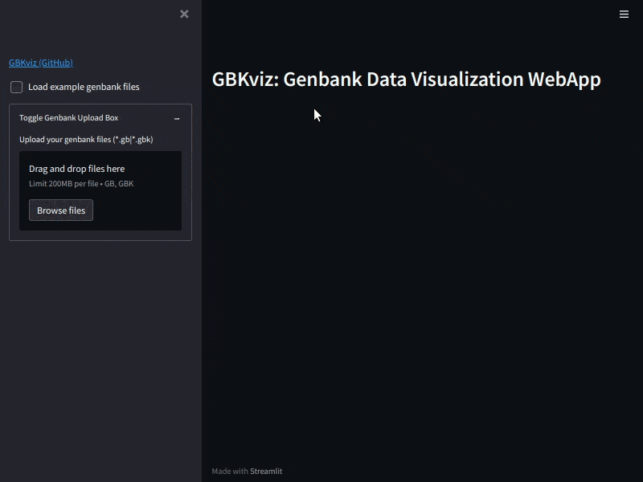

# GBKviz: Genbank Data Visualization WebApp

  

## Overview

GBKviz is a web-based Genbank data visualization tool developed with streamlit web framework.
GBKviz allows user to easily and flexibly draw CDSs in specified genomic region.
It also supports drawing genome comparison results by MUMmer.
This software is developed under the strong inspiration of [EasyFig](https://mjsull.github.io/Easyfig/).

## Install

GBKviz is implemented in Python3 (Tested on Ubuntu20.04)

Install PyPI stable version with pip:

    pip install gbkviz

If you want to enable genome comparison in GBKviz, MUMmer is required.  

Install MUMmer with apt command (Ubuntu):

    sudo apt install mummer

### Dependencies

- [Streamlit](https://streamlit.io/)  
  Web framework for quick development

- [BioPython](https://github.com/biopython/biopython)  
  Utility tools for computational molecular biology

- [MUMmer](https://github.com/mummer4/mummer)  
  Genome alignment tool for comparative genomics
  
## Command Usage

Launch GBKviz in web browser (<http://localhost:8501>):

    gbkviz_webapp

## Usage

### SideBar Widgets

- `Load example genbank files` *Checkbox*
- `Upload your genbank files` *File Uploader*
- `Label` *Checkbox*
- `Scale` *Checkbox*
- `ScaleTicks` *Checkbox*
- `Feature Label Type` *Selectbox*
- `Feature Symbol` *Selectbox*
- `Label Angle` *Selectbox*
- `ScaleTicks Interval` *Selectbox*
- `Label Font Size` *Numberinput*
- `ScaleTicks Font Size` *Numberinput*
- `Fig Width(cm)` *Slider*
- `Fig Track Height(cm)` *Slider*
- `Fig Track Size` *Slider*
- `Target Feature Types` *Multiselect*
- `CDS` *Colorpicker*
- `gene` *Colorpicker*
- `tRNA` *Colorpicker*
- `misc` *Colorpicker*
- `Genome Comparison Type` *Selectbox*
- `Cross Link (Normal)` *Colorpicker*
- `Cross Link (Inverted)` *Colorpicker*
